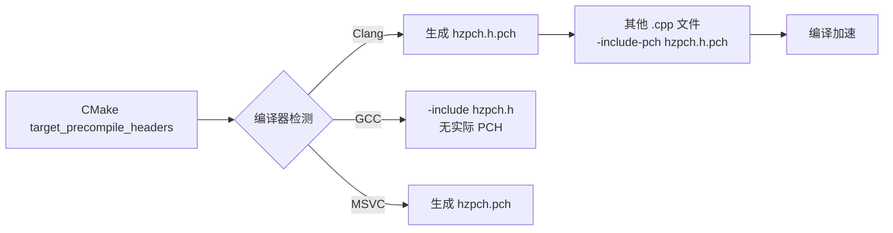

# 预编译头 (PCH) 实现计划

## 背景

参照 The Cherno 的 Hazel 游戏引擎系列，使用 CMake 的 `target_precompile_headers` 实现预编译头。

### ✅ 已完成（MSVC 版本）

- [`Hazel/src/hzpch.cpp`](../Hazel/src/hzpch.cpp) — 填充 `#include "hzpch.h"`
- [`CMakeLists.txt`](../CMakeLists.txt) — `GLOB_RECURSE` 只收集 `.cpp`，启用 `target_precompile_headers`
- 所有 `.cpp` 文件 — 添加 `#include "hzpch.h"` 作为第一个包含
- 已验证 MSVC 编译通过

### 🔄 当前任务：切换到原生 Clang + Ninja

---

## 方案概览

原生 Clang 在 Windows 上使用 Ninja 构建系统。CMake 的 `target_precompile_headers` 已支持 Clang，但需要做以下调整：

| 方面 | MSVC 方案 | Clang + Ninja 方案 |
|------|-----------|-------------------|
| 生成器 | `Visual Studio 17 2022` | `Ninja` |
| 编译器 | cl.exe (自动检测) | clang/clang++ (需指定) |
| PCH 机制 | `/Yc` / `/Yu` | `-include-pch` + `.pch` 文件 |
| PCH 时间戳 | 自动处理 | 需 `-Xclang -fno-pch-timestamp` |
| 配置方式 | 命令行参数 | CMakePresets.json (推荐) |

---

## 步骤详解

### 步骤 1：修改 `CMakeLists.txt` — 添加 Clang 专用选项

在现有 `target_precompile_headers` 下方添加 Clang 条件编译选项：

```cmake
# Clang PCH 时间戳处理（防止 PCH 因时间戳差异而失效）
if(CMAKE_CXX_COMPILER_ID MATCHES "Clang")
  target_compile_options(Hazel PRIVATE
    -Xclang -fno-pch-timestamp
  )
  target_compile_options(Sandbox PRIVATE
    -Xclang -fno-pch-timestamp
  )
endif()
```

**为什么需要 `-Xclang -fno-pch-timestamp`**：Clang 默认会在 PCH 文件中嵌入时间戳，导致修改 `.h` 文件后 PCH 被判定为过期而重新生成。此标志禁用此行为，减少不必要的重编译。

### 步骤 2：创建 `CMakePresets.json`

新增文件 [`CMakePresets.json`](../CMakePresets.json)，包含两个预设：

| 预设名 | 生成器 | 用途 |
|--------|--------|------|
| `clang-ninja` | Ninja | 原生 Clang 开发 |
| `msvc` | Visual Studio 17 2022 | MSVC 开发（保留） |

```json
{
  "version": 3,
  "configurePresets": [
    {
      "name": "clang-ninja",
      "displayName": "Clang + Ninja",
      "generator": "Ninja",
      "binaryDir": "${sourceDir}/build/clang-ninja",
      "cacheVariables": {
        "CMAKE_C_COMPILER": "clang",
        "CMAKE_CXX_COMPILER": "clang++",
        "CMAKE_CXX_STANDARD": "20"
      }
    },
    {
      "name": "msvc",
      "displayName": "Visual Studio MSVC",
      "generator": "Visual Studio 17 2022",
      "binaryDir": "${sourceDir}/build/msvc",
      "architecture": {
        "value": "x64",
        "strategy": "set"
      },
      "cacheVariables": {
        "CMAKE_CXX_STANDARD": "20"
      }
    }
  ],
  "buildPresets": [
    {
      "name": "clang-ninja",
      "configurePreset": "clang-ninja"
    },
    {
      "name": "msvc",
      "configurePreset": "msvc"
    }
  ]
}
```

### 步骤 3：验证编译

```bash
# Clang + Ninja 配置
cmake --preset clang-ninja

# 编译
cmake --build --preset clang-ninja

# 如需指定配置类型（Ninja 需要）
cmake --build --preset clang-ninja --config Debug
```

预期结果：
- CMake 检测到 Clang 编译器
- PCH 正确生成（`hzpch.h.pch` 文件）
- `Hazel.dll` 和 `Sandbox.exe` 正常编译链接
- `compile_commands.json` 生成，clangd 正常工作

---

## Clang PCH 工作原理



---

## 可能的问题与解决方案

| 问题 | 解决方案 |
|------|---------|
| `clang`/`clang++` 不在 PATH 中 | 指定完整路径，或使用 `-DCMAKE_C_COMPILER=...` |
| Ninja 未安装 | `winget install Ninja-build.Ninja` |
| Windows.h 在 Clang 下找不到 | Clang 需要 Windows SDK，通常 VS 自带 |
| PCH 文件过大（Windows.h） | 考虑将 Windows.h 从 PCH 移出，仅包含 STL |
| `__declspec(dllexport)` 不识别 | Clang on Windows 完全支持 `__declspec` |

## 总结

现有的 `target_precompile_headers` 已经跨平台兼容 Clang 和 MSVC。主要的两项额外工作是：

1. **`CMakeLists.txt`** — 添加 `-Xclang -fno-pch-timestamp` 编译选项
2. **`CMakePresets.json`** — 新增文件，简化 Clang+Ninja 和 MSVC 之间的切换
